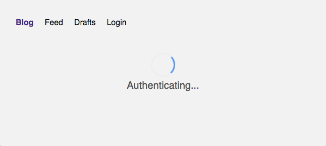

# prisma-auth0-vue

### Authentification and authorization with [Vue](https://vuejs.org/), [Auth0](https://auth0.com/) and [Prisma](https://prisma.io)/[GraphQL](https://graphql.org/)


## Credits:
[StoryBlok > How to add Auth0 Authentication to a Vue.js App](https://www.storyblok.com/tp/how-to-auth0-vuejs-authentication)
[LawJolla/prisma-auth0-example (go here for auth0 setup description)](https://github.com/LawJolla/prisma-auth0-example)


## Quickstart
```bash
git clone https://github.com/kjetilge/prisma-auth0-vue.git
cd prisma-auth0-vue/client
cp example.auth0-variables.js auth0-variables.js # Then fill in your auth0 params
npm i # Or yarn
npm run dev # Or yarn dev
cd ../server
cp example.env .env # Then fill in your PRISMA/AUTH params
npm i # Or yarn
npm run dev # Or yarn dev
```
